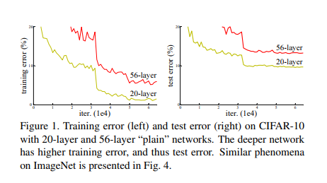
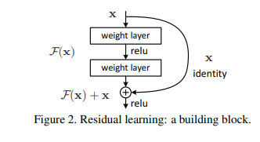
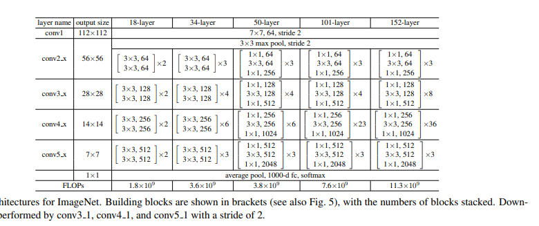

# Understanding the Problem Before ResNet

## Introduction

Before ResNet (Residual Networks) was introduced, training deep neural networks was a significant challenge. As researchers tried to make networks deeper to improve their performance, they encountered a major problem known as the **"degradation problem."**

## The Degradation Problem

### What Is It?

The degradation problem occurs when increasing the depth of a neural network results in **higher training error**. This is surprising because, in theory, a deeper network should perform at least as well as a shallower one.

### Why Does This Happen?

The issue isn't about **overfitting** (where a model performs well on training data but poorly on new data). Instead, it's about the difficulty in **optimizing** very deep networks. Here's what happens:

- **Vanishing/Exploding Gradients:** As networks get deeper, the gradients (used to update the network during training) can become very small (vanishing) or very large (exploding). This makes it hard for the network to learn effectively.

- **Training Error Increases:** Even with techniques like special initialization and normalization to help with the vanishing/exploding gradient problem, adding more layers still caused **higher training error**. This means the network struggled to learn as it got deeper.

## Why Was This a Problem?

If deeper networks lead to worse performance, it limits how much we can improve a model by adding more layers. This was a big obstacle because researchers knew that deeper networks should, in theory, be able to capture more complex patterns and perform better.

## How Did ResNet Solve This?

ResNet introduced a new way of thinking about layers in a deep network. Instead of just stacking layers and hoping the network learns well, ResNet used **residual learning**:

- **Residual Learning:** The network learns to predict the difference (or "residual") between the output it wants and the output it currently has. This makes it easier for the network to learn even when it's very deep.

By using residual learning, ResNet made it possible to train networks with **hundreds** of layers, leading to significant improvements in performance on tasks like image classification.

## Conclusion

Before ResNet, the degradation problem made it hard to train very deep neural networks. ResNet's innovation of residual learning solved this problem, allowing for the creation of much deeper and more powerful networks.

# Understanding Skip Connections and Residual Blocks in ResNets

## Skip Connections

### What Are Skip Connections?

In deep neural networks, **skip connections** (also known as **shortcut connections**) are special pathways that bypass one or more layers. They allow the network to add the input of a block directly to its output.

### Why Are Skip Connections Important?

Skip connections help to solve a major problem in deep networks called the **vanishing gradient problem**. When a network is very deep, the gradients used to update the weights can become very small, making it hard for the network to learn. By using skip connections, the network can bypass some layers and ensure that the gradients have a more direct path, which helps in better training.

## Residual Blocks

### What Is a Residual Block?

A **residual block** is a fundamental building block of ResNets. Here's how it works:

1. **Two Weight Layers:** Each residual block contains two layers of weights (or neurons).
2. **ReLU Activation:** Each weight layer is followed by a ReLU activation function, which helps in introducing non-linearity.
3. **Shortcut Connection:** The input to the block is added to the output of the second weight layer. This is the **shortcut connection**.

### How Does a Residual Block Work?

1. **Input and Output:** Let's denote the input to a residual block as \( x \). The block applies two weight layers to \( x \), producing an output.
2. **Adding Input:** The output of the second weight layer is then added to the original input \( x \). This sum is the final output of the residual block.

   Mathematically, if \( F(x) \) is the function learned by the two weight layers, the output is \( F(x) + x \). This means the block learns the residual (or difference) between the desired output and the input \( x \), and then adds the input back.

### Why Use Residual Blocks?

- **Easier Learning:** By learning the residual (or difference) rather than the original function, it becomes easier for the network to learn. If the optimal function is close to an identity mapping (i.e., the output should be similar to the input), it's easier to adjust the residual to be close to zero.
- **Improved Training:** Residual blocks help prevent the vanishing gradient problem and allow very deep networks to be trained more effectively.

# architecture of ResNet models

This image depicts the architecture of ResNet models of varying depths: 18-layer, 34-layer, 50-layer, 101-layer, and 152-layer.

Let's dig deeper into anyone of them, say ResNet50...

# Architecture of ResNet-50

## Overview

**ResNet-50** is a type of Residual Network (ResNet) that is known for its deep architecture, specifically having 50 layers. It is designed to address issues in training very deep neural networks by using residual learning with shortcut connections.

## Key Components of ResNet-50

1. **Input Layer**
   - **Size:** 224x224x3 (Height x Width x Channels)
   - **Purpose:** The input layer receives the raw image data, which is then processed through the network.

2. **Initial Convolution Layer**
   - **Layer:** Convolutional layer with a kernel size of 7x7
   - **Stride:** 2
   - **Purpose:** This layer performs initial feature extraction from the input image.

3. **Max Pooling Layer**
   - **Kernel Size:** 3x3
   - **Stride:** 2
   - **Purpose:** Reduces the spatial dimensions of the feature maps, making the network more computationally efficient.

4. **Residual Blocks**

   ResNet-50 consists of a series of residual blocks, each designed to learn residual mappings. The architecture uses **bottleneck blocks** which are more efficient compared to standard residual blocks.

   - **Bottleneck Block Structure:**
     1. **1x1 Convolution:** Reduces the number of channels, acting as a compression layer.
     2. **3x3 Convolution:** Performs the main convolution operation.
     3. **1x1 Convolution:** Expands the number of channels back to a higher dimension.

   - **Shortcut Connections:** Add the input of the block directly to its output, helping with gradient flow and training.

5. **Residual Block Groups**

   ResNet-50 is divided into four groups of residual blocks:

   - **Group 1:** 
     - **Layers:** 3 Bottleneck Blocks
     - **Output Channels:** 256
     - **Stride:** 1 (for all blocks in this group)

   - **Group 2:**
     - **Layers:** 4 Bottleneck Blocks
     - **Output Channels:** 512
     - **Stride:** 2 (for the first block in this group)

   - **Group 3:**
     - **Layers:** 6 Bottleneck Blocks
     - **Output Channels:** 1024
     - **Stride:** 2 (for the first block in this group)

   - **Group 4:**
     - **Layers:** 3 Bottleneck Blocks
     - **Output Channels:** 2048
     - **Stride:** 2 (for the first block in this group)

6. **Global Average Pooling Layer**
   - **Purpose:** Reduces each feature map to a single value by averaging over the entire spatial dimensions.
   - **Output Size:** 1x1x2048

7. **Fully Connected Layer**
   - **Purpose:** Converts the feature vector to class scores for classification.
   - **Output Size:** Number of classes (e.g., 1000 for ImageNet classification)

8. **Softmax Activation**
   - **Purpose:** Converts the output scores into probabilities for classification tasks.

